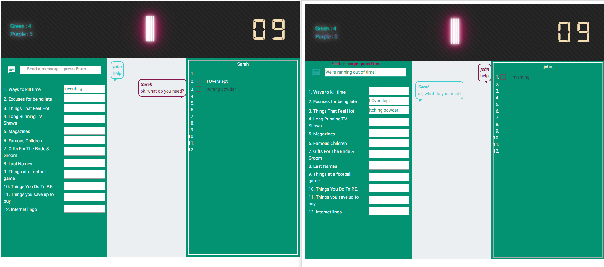
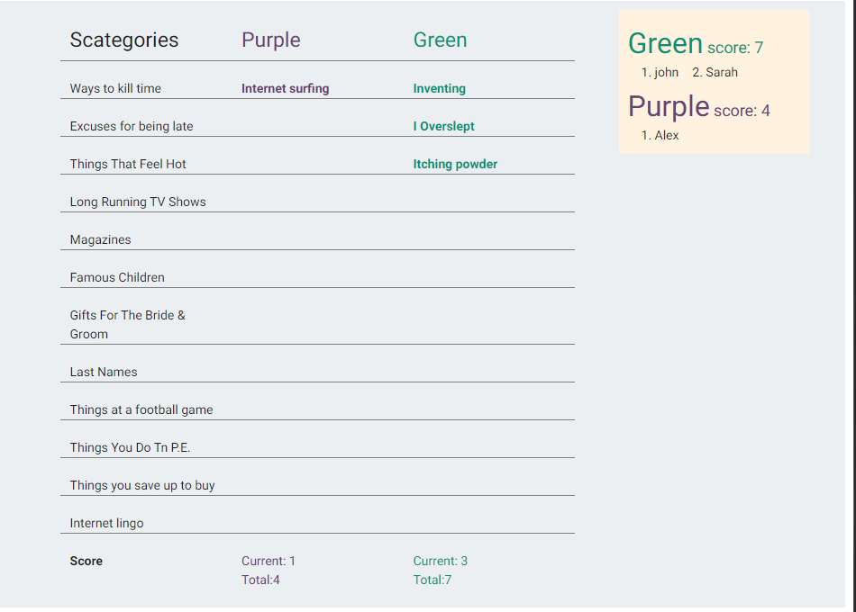
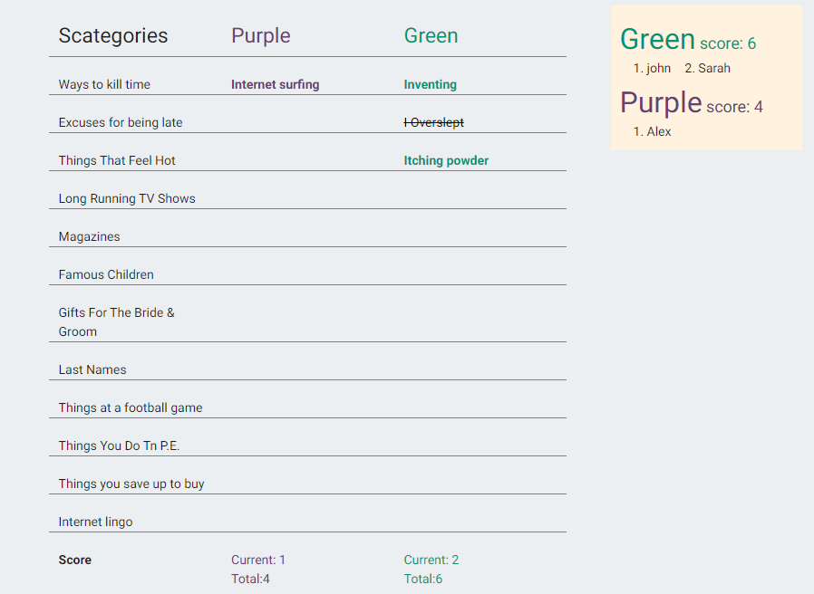

# scategories
create the Scategories game online using web sockets and React.

Using SocketIO to create the web socket connection between the client and server. I am clustering the node server to operate as a psuedo load balancer. 
The server counts how many processors it has and spreads the load out among them.  The node server keeps track of who is on which server.

I'm separating the sockets by group so only people belonging to your group will be on your web socket. 
I am also separating sub groups so each team will be able to communicate separately within the team.

below is a picture of two people on the same team playing. They can message each other within the team and vote on other players answers.

When time is up, the scores are added up.

If an answer isn't agreed upon, you can click on it and it will be crossed out and not added to the score. Any duplicate answer between opposing teams will also be crossed out.

